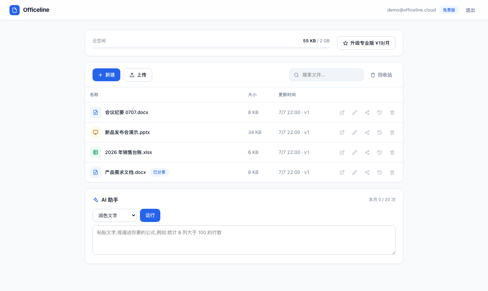
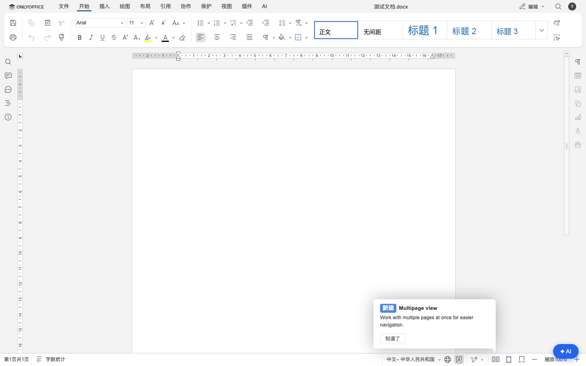

# Officeline

**开源的云文档办公套件** — 文档 · 表格 · 演示,自带云存档、版本历史、只读分享、回收站与 AI 助手。

*Open-source cloud office suite — docs, sheets & slides with built-in cloud storage, version history, share links, trash bin and an AI assistant. Powered by the ONLYOFFICE editing engine; everything else (cloud backend, subscription quota, AI proxy, desktop shell) is built from scratch with zero server dependencies (plain Node.js + SQLite).*

[](LICENSE)


| 云端文件列表 | 完整编辑器 + AI |
|---|---|
|  |  |

## 功能

- 📄 **完整 Office 编辑**:docx / xlsx / pptx,深度兼容(ONLYOFFICE 引擎,中文界面)
- ☁️ **云存档**:每次保存自动生成新版本,历史版本一键无损恢复
- 🔗 **只读分享**:一条链接分享给任何人,可随时关闭
- 🗑 **回收站**:误删找回,彻底删除释放空间
- ✨ **AI 助手**:润色 / 总结 / 翻译 / 自然语言生成表格公式(任何 OpenAI 兼容 API,默认 DeepSeek)
- 💾 **存储可插拔**:本地磁盘或任意 S3 兼容对象存储(Cloudflare R2 / MinIO / AWS,零依赖 SigV4 驱动)
- 👥 **订阅配额**:免费版 5GB + 20 次 AI/月(用完每周仍赠 3 次体验),专业版 100GB + 1000 次(支付网关自行接入)
- 🖥 **桌面客户端**:Electron 壳,macOS DMG 一键打包(`cd desktop && npm run dist`)

## 快速开始

需要:Docker、Node.js ≥ 22(用到内置 `node:sqlite`)。

```bash
git clone https://github.com/buyaogai2023/officeline.git && cd officeline

# 1. 启动 ONLYOFFICE Document Server(会自动打"允许私网回访"补丁,缺它会报错 -4)
bash deploy/setup-ds.sh

# 2. 启动云后端(零 npm 依赖,无需 install)
node server/src/server.js

# 3. 打开 http://localhost:9130 注册账号即可使用
```

冒烟测试(9 项全链路):`./scripts/smoke.sh`

## 架构

```
desktop/            Electron 桌面壳(加载本地服务)
server/src/
  server.js         全部 API:认证、文件/版本、分享、回收站、配额、AI 代理、ONLYOFFICE 回调
  storage.js        存储驱动:local | s3(SigV4,零依赖)
server/public/      Web 界面(原生 HTML/CSS/JS,设计令牌双主题)
deploy/             Document Server 启动脚本 + 云端 docker-compose 模板
```

数据流:浏览器/桌面壳 → 后端(9130)⇄ Document Server(8080,经容器网络回访 9130 拉取与保存文档)。

## 生产部署

参考 [`deploy/docker-compose.cloud.yml`](deploy/docker-compose.cloud.yml):Document Server + 后端 + R2 对象存储 + DeepSeek。上线前请开启 DS 的 JWT 并置于 HTTPS 反代之后。

| 环境变量 | 默认 | 说明 |
|---|---|---|
| `OFFICELINE_PORT` | 9130 | 后端端口 |
| `OFFICELINE_DS_PUBLIC` | http://localhost:8080 | 浏览器访问 DS 的地址 |
| `OFFICELINE_SELF_FOR_DS` | http://host.docker.internal:9130 | DS 回访后端的地址 |
| `OFFICELINE_STORAGE` | local | `s3` 走对象存储 |
| `OFFICELINE_S3_ENDPOINT/BUCKET/KEY/SECRET/REGION` | — | s3 模式必填 |
| `OFFICELINE_AI_KEY` | (演示模式) | OpenAI 兼容 API Key |
| `OFFICELINE_AI_BASE` / `OFFICELINE_AI_MODEL` | api.deepseek.com / deepseek-chat | 可换任意兼容服务 |
| `OFFICELINE_DATA` | server/data | 数据目录 |
| `OFFICELINE_SOURCE_URL` | 本仓库 | 页脚源码链接(AGPL 网络条款) |

## 协议与商业模式

- 本项目以 **AGPL-3.0** 开源(见 [LICENSE](LICENSE)),与所用的 ONLYOFFICE 内核协议一致;
- 代码自由使用、修改、自部署;基于本项目对外提供网络服务时,须按 AGPL 向你的用户提供源代码;
- 官方托管版通过**云存档订阅 + AI 额度**收费——付费买的是托管、同步与省心,不是代码;
- ONLYOFFICE 是 Ascensio System SIA 的商标,本项目与其无隶属关系。

## Roadmap

- [ ] 生产 JWT / HTTPS 加固
- [ ] 支付接入(Paddle / 微信支付)
- [ ] Windows 安装包与代码签名
- [ ] 多人协作编辑(DS 原生支持,待打通)
- [ ] 文件夹与团队空间
